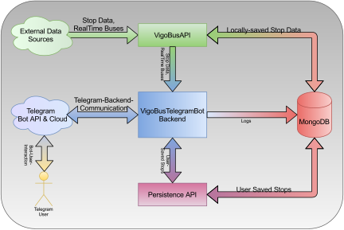

# VigoBus-TelegramBot

Telegram Bot that serves bus stops and real-time estimated time of arrival for the buses of the city of Vigo.

_Bot de Telegram que permite consultar las paradas y autobuses que se dirigen a las mismas -junto a su tiempo restante de llegada, en tiempo real-, en la red de transporte urbano de la ciudad de Vigo._

## Microservice structure

- VigoBusAPI: REST API to fetch stop & real-time estimated time of buses arrival
- Persistence API: REST API to persist data
- MongoDB: used by both API to persist data

## Requirements

- Python >= 3.6
- [VigoBusAPI](https://github.com/David-Lor/Python_VigoBusAPI)
- [DataManager (Persistence API)](https://github.com/David-Lor/Telegram-BusBot-DataManager)
- requirements listed in [requirements.txt](requirements.txt)
- A Telegram bot created with BotFather
- Docker recommended for deployment using the [Python-Autoclonable-App](https://github.com/David-Lor/Docker-Python-Autoclonable-App) image

## Changelog

- 0.1.7 (WIP)
    - fix stop remove name
    - remove usage of external pybusent library in favor of self-defined classes
    - sort user saved stops by stop custom or real name
    - fix: stop rename crashing
- 0.1.6 - Add logging
- 0.1.5:
    - fix: stop rename crashing
    - add error handler for uncatched global, generic exceptions
    - switch from requests_async to httpx
    - add retries on HTTP requests
    - add user request rate limit (amount per time)
- 0.1.4 - Button on Stop messages to show More/Less buses
- 0.1.3 - Support for setting custom stop names on user saved stops
- 0.1.2 - Support for Saved Stops and working command to list all of them
- 0.1.1 - Inline keyboard markup with callback support for Refreshing Stop messages
- 0.1.0 - Initial async version (basic Get Stop messages)

## Disclaimer

This project is not endorsed by, directly affiliated with, maintained by, sponsored by or in any way officially related with the company, companies and/or entities responsible for the public transport service of the city of Vigo.

_Este proyecto no cuenta con soporte de, no está afiliado con, mantenido por, patrocinado por ni en cualquier otra manera oficialmente vinculado con la compañía, compañías y/o entidades responsables del sistema de transporte público de la ciudad de Vigo._
